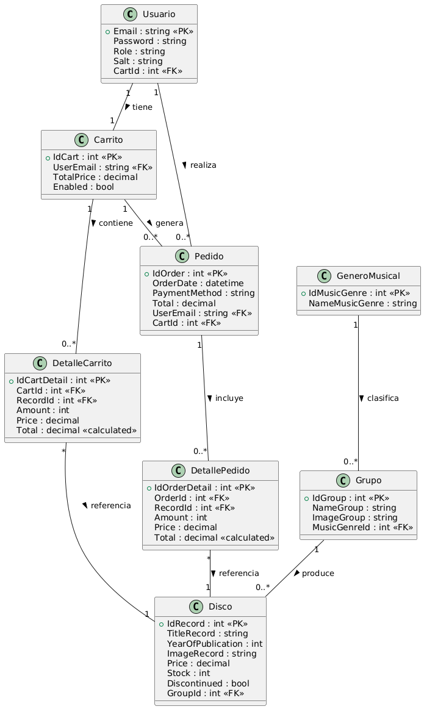
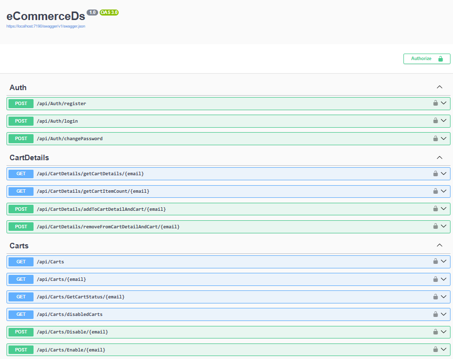
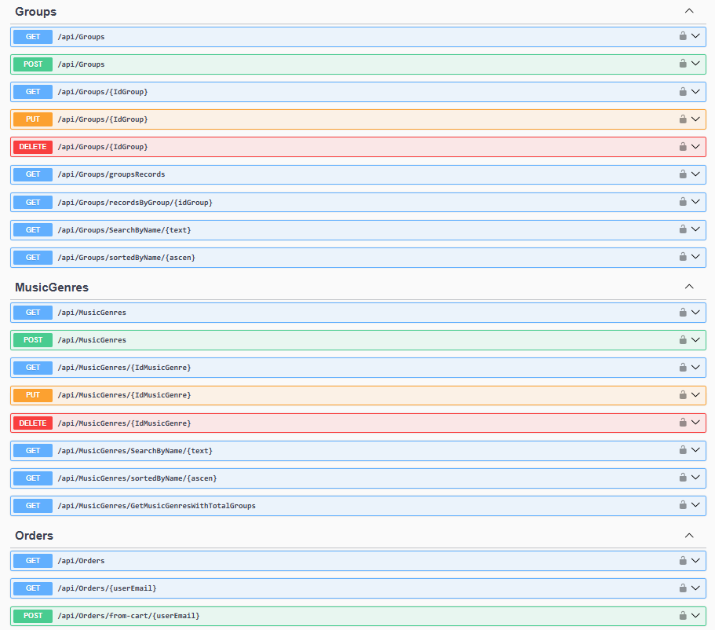
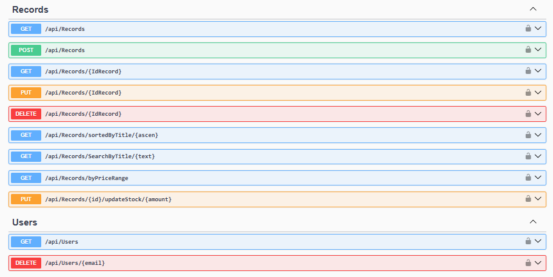
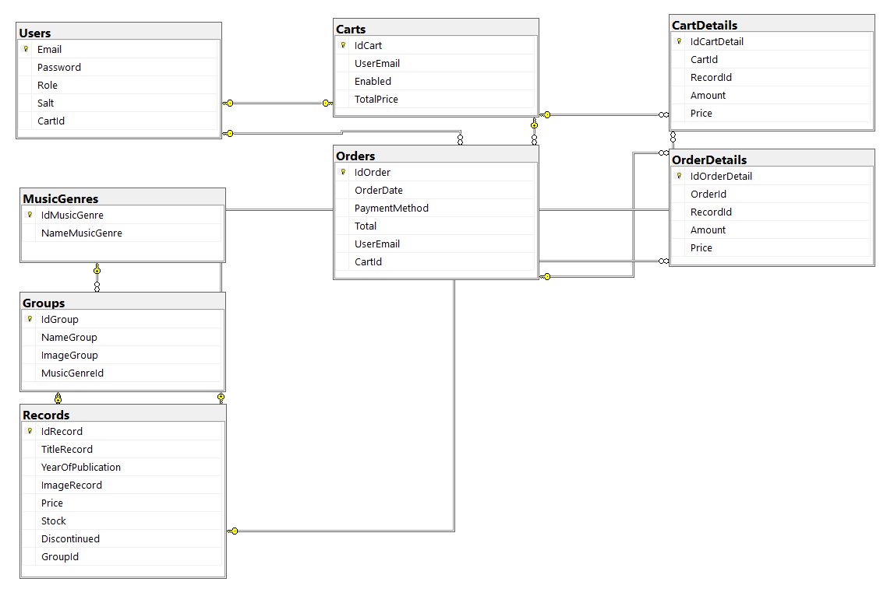

## eCommerceDs_Docker

**eCommerceDs_Docker** is an ASP.NET Core Web API project. It is the backend service layer for an e-commerce application, focused on data management. The Repository implements the data access logic. The Services contain the application's business logic. Key features implemented in the project include: Authentication and Authorization, User Management, Catalog Management, Shopping Cart Management, and Order Management.



eComerceDs_Docker/      
├── eComerceDs/    
│   ├── AutoMappers/    
│   │   └── MappingProfile.cs    
│   ├── Classes/    
│   │   └── HashResult.cs    
│   ├── Controllers/    
│   │   ├── AuthController.cs    
│   │   ├── CartDetailsController.cs    
│   │   ├── CartsController.cs    
│   │   ├── GroupsController.cs    
│   │   ├── MusicGenresController.cs    
│   │   ├── OrdersController.cs    
│   │   ├── RecordsController.cs    
│   │   └── UsersController.cs    
│   ├── DTOs/    
│   │   ├── CartDetailDTO.cs    
│   │   ├── CartDetailInfoDTO.cs    
│   │   ├── CartDTO.cs  
│   │   ├── CartStatusDTO.cs  
│   │   ├── ChangePasswordDTO.cs  
│   │   ├── GroupDTO.cs  
│   │   ├── GroupInsertDTO.cs  
│   │   ├── GroupItemDTO.cs 
│   │   ├── GroupRecordsDTO.cs  
│   │   ├── GroupUpdateDTO.cs  
│   │   ├── LoginResponseDTO.cs  
│   │   ├── MusicGenreDTO.cs  
│   │   ├── MusicGenreInsertDTO.cs 
│   │   ├── MusicGenreItemDTO.cs  
│   │   ├── MusicGenreTotalGroupsDTO.cs  
│   │   ├── MusicGenreUpdateDTO.cs  
│   │   ├── OrderDetailDTO.cs  
│   │   ├── OrderDTO.cs  
│   │   ├── RecordDTO.cs  
│   │   ├── RecordInsertDTO.cs  
│   │   ├── RecordItemDTO.cs  
│   │   ├── RecordItemExtDTO.cs  
│   │   ├── RecordUpdateDTO.cs  
│   │   ├── UserDTO.cs  
│   │   ├── UserInsertDTO.cs  
│   │   └── UserLoginDTO.cs  
│   ├── Models/  
│   │   ├── Cart.cs  
│   │   ├── CartDetail.cs  
│   │   ├── eCommerceDsContext.cs  
│   │   ├── Group.cs  
│   │   ├── MusicGenre.cs  
│   │   ├── Order.cs  
│   │   ├── OrderDetail.cs  
│   │   ├── Record.cs  
│   │   └── User.cs  
│   ├── Repository/  
│   │   ├── CartDetailRepository.cs  
│   │   ├── CartRepository.cs  
│   │   ├── GroupRepository.cs  
│   │   ├── ICartDetailRepository.cs  
│   │   ├── ICartRepository.cs  
│   │   ├── IeCommerceDsRepository.cs  
│   │   ├── IGroupRepository.cs  
│   │   ├── IMusicGenreRepository.cs  
│   │   ├── IOrderRepository.cs  
│   │   ├── IRecordRepository.cs  
│   │   ├── IUserRepository.cs  
│   │   ├── MusicGenreRepository.cs  
│   │   ├── OrderRepository.cs  
│   │   ├── RecordRepository.cs  
│   │   └── UserRepository.cs  
│   ├── Services/  
│   │   ├── CartDetailService.cs  
│   │   ├── CartService.cs  
│   │   ├── FileManagerService.cs  
│   │   ├── GroupService.cs  
│   │   ├── HashService.cs  
│   │   ├── ICartDetailService.cs  
│   │   ├── ICartService.cs  
│   │   ├── IeCommerceDsService.cs  
│   │   ├── IFileManagerService.cs  
│   │   ├── IGroupService.cs  
│   │   ├── IMusicGenreService.cs  
│   │   ├── IOrderService.cs  
│   │   ├── IRecordService.cs  
│   │   ├── ITokenService.cs  
│   │   ├── IUserService.cs  
│   │   ├── MusicGenreService.cs  
│   │   ├── OrderService.cs  
│   │   ├── RecordService.cs  
│   │   ├── TokenService.cs  
│   │   └── UserService.cs  
│   ├── Validators/  
│   │   ├── FileTypeValidator.cs  
│   │   ├── GroupFileType.cs  
│   │   ├── GroupInsertValidator.cs  
│   │   ├── GroupUpdateValidator.cs  
│   │   ├── MusicGenreInsertValidator.cs  
│   │   ├── MusicGenreUpdateValidator.cs  
│   │   ├── RecordInsertValidator.cs  
│   │   ├── RecordUpdateValidator.cs  
│   │   └── WeightFileValidator.cs     
│   ├── appsettings.json  
│   ├── Dockerfile  
│   └── Program.cs  
└── docker-compose.yml






## Program
```cs
builder.Services.AddDbContext<AlmacenContext>(options =>
    options.UseSqlServer(builder.Configuration.GetConnectionString("Connection"))
);
``` 

## appsetting.Development.json
```cs
{
  "ConnectionStrings": {
        "Connection": "Server=ecommerce-db;Database=ecommerceDs;User Id=sa;Password=YourStrong@Passw0rd;Encrypt=false;TrustServerCertificate=True"
}
``` 



[DeepWiki moraisLuismNet/eCommerceDs_Docker](https://deepwiki.com/moraisLuismNet/eCommerceDs_Docker)